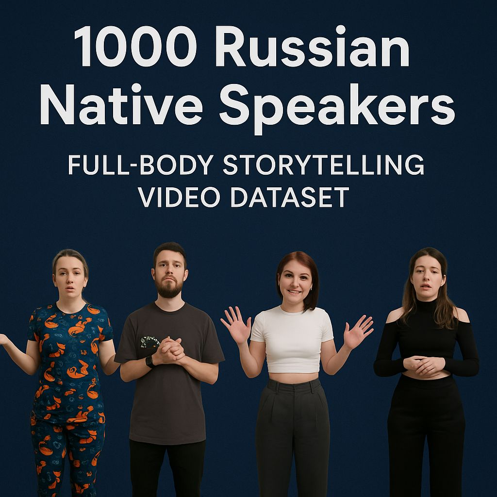

# Russian Storytelling Video Dataset for AI Training

This dataset contains high-quality video recordings of **700 native Russian speakers**, each speaking freely for 10+ minutes. The content includes full-body video with visible gestures, facial expressions, and natural speech — making it ideal for training **multimodal AI models**.

## 📦 Dataset Overview
- 700 unique participants
- 10+ minutes of video per participant
- At least Full HD (1920x1080), many samples in 2K and 4K, 30 FPS
- Natural speech in Russian (unscripted)
- Full-body framing (waist-up or lower)
- Visible face, gestures, body language
- Clean lighting and audio
- Commercial usage rights secured
- Includes age and gender metadata

## 📊 Sample
- See: [`sample_video_dataset_100_participants.csv`](sample_video_dataset_100_participants.csv)
- Screenshots: [`storytelling_dataset_updated_screenshots.zip`](storytelling_dataset_updated_screenshots.zip)
- Preview PDF: [`Storytelling_Dataset_Presentation_FINAL_v2.pdf`](Storytelling_Dataset_Presentation_FINAL_v2.pdf)

## 🔍 Use Cases
- Multimodal model training
- Emotion and gesture recognition
- Conversational avatars
- VR/AR training simulation
- NLP and speech-to-text applications

## 💼 Licensing
This dataset is provided under a **non-exclusive commercial license**. Redistribution is prohibited.  
See: [`storytelling_dataset_license_agreement.pdf`](storytelling_dataset_license_agreement.pdf)

## 💬 Contact
- Email: **Chinzad@gmail.com**  
- Telegram: **@Marat_DV**

---

## 📌 Описание на русском

Набор видеоданных с 700 русскоязычными участниками, рассказывающими истории свободным текстом. Видео в высоком качестве (Full HD и выше), съёмка по колено, видны жесты, мимика, эмоции. Идеально подходит для задач обучения моделей речи, видеоаналитики и распознавания эмоций.

Каждое видео: 10+ минут, 30 FPS, Full HD и выше  
Участники дали разрешение на коммерческое и AI-использование.

📩 Контакт: chinzad@gmail.com  
📬 Telegram: @Marat_DV